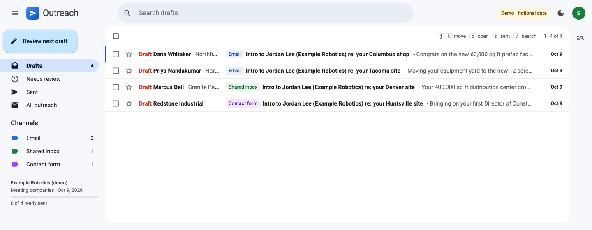
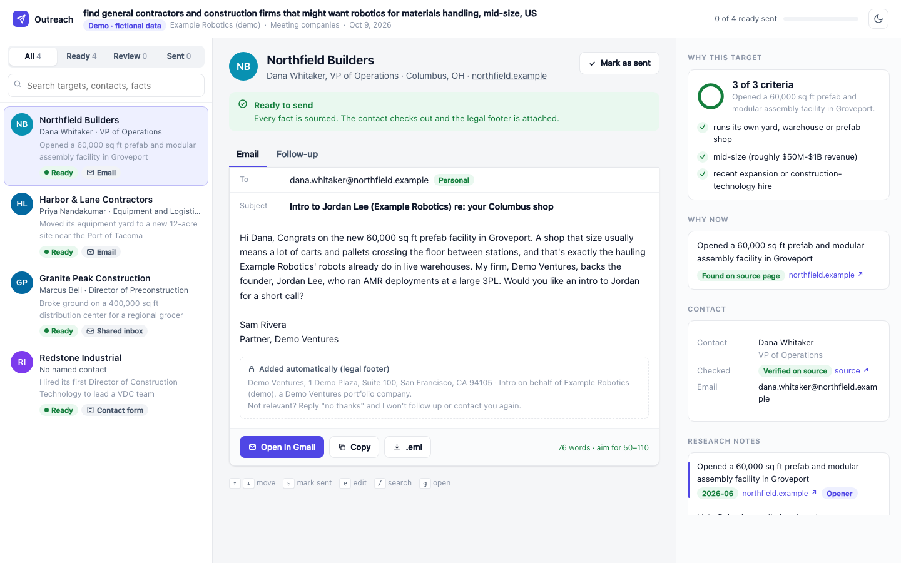
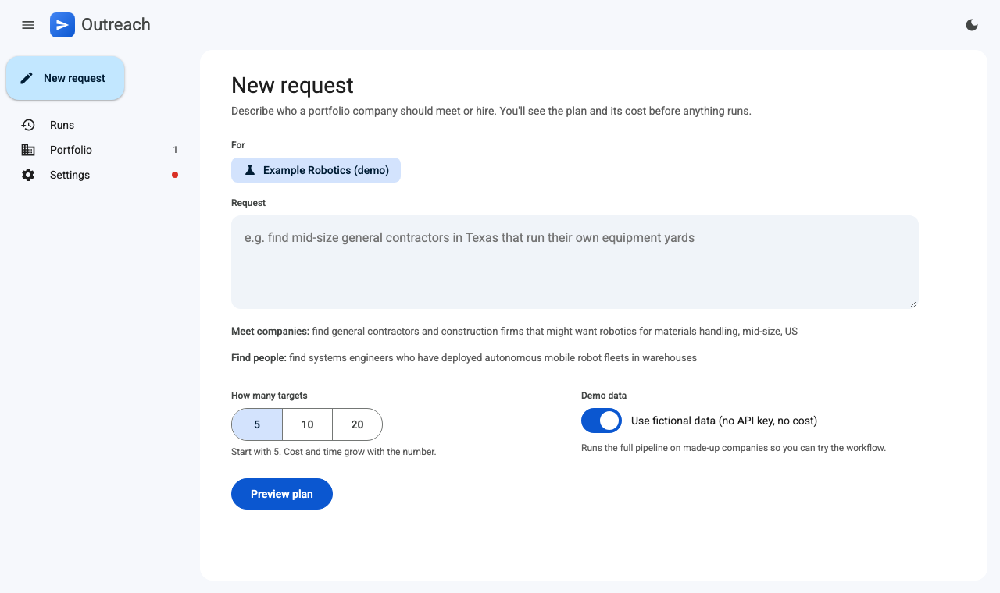

# outreach-agent

Proof-of-concept tool for portfolio support requests, with a local web app and a CLI. Give
it a plain-English request and pick a portfolio company. It works out whether you want to **meet companies** (customers,
pilot sites, partners) or **find people** (e.g. a specific kind of engineer to hire). It shows
you its plan, searches the web for targets, and drafts a personalized, fact-checked message for
each one, written as you, the investor. Each message comes with a follow-up and a short
LinkedIn note. Results land on a review page with a one-click action per target.
**It never sends anything.** You review each message and send it yourself.




## Quick start

```bash
git clone https://github.com/A5bhinav/outreach-agent && cd outreach-agent
./setup.sh                          # virtualenv, dependencies, tests, offline demo
.venv/bin/python main.py --serve    # the app, in your browser
```



The web app runs on your own machine at `127.0.0.1:8765`:
1. **Settings:** your name, firm, email and firm address, plus your Anthropic API key. Keys can be remembered in a git-ignored `.env`.
2. **Portfolio:** one profile per portfolio company, edited as a form.
3. **New request:** pick the company and type who they should meet or hire. Before anything is spent you see the plan: what counts as a fit, the must-haves, who to contact, the searches, and an estimate of calls, web searches and time. Then click **Run it**.
4. **The run page:** shows each stage and the targets as they finish, with a Stop button.
5. **Open inbox:** the Gmail-style review inbox. Marking a draft as sent there updates the shared ledger directly.

Without an API key, switch on **Demo data** to run the whole flow on fictional companies at no cost. The server only listens on your machine, accepts requests from its own pages only, and runs one job at a time.

### Without the app

The command line does everything the app does:

`python main.py --demo` runs the pipeline offline on fictional data and opens the review inbox. The demo:
- runs the real pipeline end to end: planning, sourcing, research, contact checks, writing, review, the ledger and every output file;
- uses a scripted model and fictional companies and people (`.example` domains);
- needs no API key, profile or sender file, and makes no network calls;
- can be run again any time, in either mode:

```bash
.venv/bin/python main.py --demo
.venv/bin/python main.py --demo "find systems engineers who have deployed AMR fleets"
```

The setup script prints the five steps to a real run at the end (also under Setup below).

## Pipeline

| Step | Module | What it does |
|---|---|---|
| 0. Preflight | `agents/llm.py` | One cheap web-search call so a broken setup fails in seconds; switches to direct search if the org refuses dynamic filtering |
| 1. Planner | `agents/planner.py` | Request → mode (`companies` / `people`), 5-8 search queries (including trigger-event queries), rubric with must-haves, disqualifiers, target roles, research signals, the ask. **Shown to you for a yes/no before anything else is spent.** |
| 2. Sourcer | `agents/sourcer.py` | Web-searches each query concurrently; dedupes by domain and name (upgrading a name-only entry when a homepage turns up); ranks by likely fit; skips anything in the ledger |
| 3a. Researcher (companies) | `agents/researcher.py` | Researches the best ~1.5×n candidates: dated, sourced facts (none older than 18 months) and a yes/no/unclear verdict with a link per rubric criterion. Keeps companies with no failed must-have and at most one unconfirmed |
| 3b. People finder (people) | `agents/people.py` | Finds people at or from the sourced companies with dated evidence of their work (talks, papers, patents, blogs, team pages, GitHub). Shows criteria evidence, not a score; LinkedIn appears only as a link |
| 2-3 again | `main.py` | If too few qualify: research the leftover ranked candidates, then one more round of searches from new angles. This runs while the first targets are already being written |
| 4. Contact finder (companies) | `agents/contacts.py` | Named decision-maker, published email and contact-form URL, each checked against the source page's visible text; tells personal addresses from shared inboxes; optional Apollo lookup for a verified personal address |
| 5. Writer | `agents/writer.py` | 50-110-word double-opt-in intro that opens on the most recent fact, describes the startup in the recipient's terms, makes one ask; plus a follow-up built on a different fact and a ≤280-character LinkedIn note |
| 6. Reviewer | `agents/reviewer.py` | Fixes unsupported claims and style problems in place; rewrites only what it couldn't fix; checks the opening fact against its source page; flags weak (old or undated) hooks, off-domain addresses and emails that read like a template; adds the legal footer |

Each target goes through steps 4-6 on its own as soon as it's selected, and the review page
updates as each one finishes, so the first results appear within minutes.

**Models and cost controls** (`agents/llm.py`):
- **Models:** research, people finding, writing and review use `claude-opus-5-5`. Planning, sourcing and contact lookup use `claude-sonnet-5`.
- **Effort per step:** sourcing and contacts run at low effort, writing and review at medium, and research and people finding at `--effort` (default high).
- **Caching:** calls that use web search are prompt-cached, so the search-result-heavy loops are billed at cache-read rates.
- **Concurrency:** each model has its own concurrency limit (8 heavy, 16 light by default).
- **Errors:** configuration errors stop the run immediately. After preflight passes, a single failing call only drops its own target.

## Setup

Requires Python 3.10+.

```bash
cd outreach-agent
python3 -m venv .venv && source .venv/bin/activate
pip install -r requirements.txt
export ANTHROPIC_API_KEY=sk-ant-...   # or `ant auth login`
export APOLLO_API_KEY=...             # optional: verified personal emails for named contacts (companies mode)
```

Web search and web fetch must be enabled for your organization in the Claude Console.

**Profiles.** Each portfolio company gets a file in `portfolio/`; your own details live once in `sender.yaml`.

```bash
cp sender.example.yaml sender.yaml                 # your name, title, firm, email, firm postal address
python main.py --new-company "Acme Robotics"       # creates portfolio/acme-robotics.yaml from the template
python main.py --list-companies                    # shows each profile and whether it still has PLACEHOLDERs
```

Each company file has:
- **Required:** name, founder, pitch, who they want to reach, and true proof points.
- **Optional, but they make intros far stronger:** `founder_bio`, `stage_and_backers`, `investor_note` and `offer`, plus a `roles:` block for hiring requests.

The writer only uses facts from these files. `sender.yaml` is git-ignored, so your details stay off GitHub. A company file can override any sender field with its own `sender:` block, for example `voice: founder` to write as the founder instead of as you.

The tool refuses to run while a profile or `sender.yaml` has `PLACEHOLDER` values or no footer address, so it won't spend money on emails it would have to block. Use `--plan-only` to preview a plan anyway.

## Running it

```bash
# Meet companies (shows the plan, asks to proceed; default 5 targets)
python main.py "find general contractors and construction firms that might want robotics for materials handling, mid-size, US" --company acme-robotics

# Find people (the company is picked from the request when it names one)
python main.py "Acme Robotics needs systems engineers who have deployed AMR fleets in warehouses" --n 10

# A run was interrupted? Continue it without redoing finished work
python main.py --resume outputs/20261009-142233

# After sending: record what went out (all ready drafts, or --only "Name A,Name B")
python main.py --mark-sent outputs/20261009-142233

# Someone replied "no thanks": never contact them again, for any portfolio company
python main.py --opt-out jane@example.com      # or a domain: --opt-out example.com
```

Each run writes to `outputs/<timestamp>/` (or `--out DIR`), updated as each target finishes:

- `results.html`: **the review inbox; open it in a browser.** It's a single offline file, laid out like Gmail's web inbox, which is where the drafts get sent from.
  - **Folders:** Drafts (ready to send), Needs review, Sent and All. Channel labels (Email, Shared inbox, LinkedIn, Contact form) have counts, and "Review next draft" jumps straight to the next one.
  - **Rows:** like an inbox: a red "Draft" marker, the recipient, label chips, the subject and a snippet. Hover to open, mark as sent or copy; check rows to mark several as sent at once (with undo).
  - **Reading a draft:** each one reads as a thread: the email with its legal footer, the LinkedIn note where relevant, and the follow-up as a collapsed reply with its send date. The Research side panel shows why this target, why now, the contact check and the dated notes with sources.
  - **Editing:** "Edit" opens a Gmail-style compose window. "Open in Gmail" (or LinkedIn, or the contact form) always uses your edited text. Edits and sent status are saved in your browser, and the sidebar gives you the exact `--mark-sent` command for the shared ledger.
  - **Shortcuts:** Gmail-style: `j`/`k` move, `o` open, `u` back, `e` edit, `s` mark sent, `g` open in Gmail, `/` search, `?` for the full list. Marking a draft as sent moves you to the next one, like archiving in Gmail.
  - **Blocked drafts:** these keep only a muted "Open anyway" button, under a banner saying what to fix.
  - **Display:** dark mode and phone layouts work too.
- `results.md`: the same content in Markdown.
- `drafts/*.eml` and `*.followup.eml`: draft files that open in Mail, Outlook or Thunderbird.
- `results.csv`: one row per target, ready rows first.
- `run.json`: full intermediate data and usage by step, saved after each stage.

**What `status: ready` means.** A message is ready when all of these hold:
- there is a way to reach the target: a verified email address, a profile to message for people, or the company's contact form;
- any named contact wasn't contradicted by their source page;
- the reviewer raised no blockers: placeholders, an incomplete footer, or an opening fact whose details aren't on its cited page.

Shared inboxes (info@) are labeled as such. The email then greets the team and asks them to pass
it to the named person.

Options: `--n` (default 5), `--company`, `--config`, `--sender`, `--out`, `--yes`, `--plan-only`,
`--resume`, `--effort`, `--concurrency`, `--ledger`, `--mark-sent`/`--only`, `--opt-out`,
`--new-company`, `--list-companies`, `--allow-placeholders`, `--skip-preflight`.

## Contact ledger

`ledger.csv` is git-ignored and shared across runs and portfolio companies. Each ready message is
recorded as `drafted`; `--mark-sent` turns rows into `sent`, and `--opt-out` records unsubscribes.
Later runs skip:
- anyone who opted out, for every portfolio company. This matches the email, the profile, or any address at an opted-out domain.
- anyone `sent` or `replied` for the same portfolio company in the last 180 days.
- anyone drafted for the same portfolio company in the last 14 days.
- anyone sent an intro for another portfolio company in the last 30 days.

## Evals

`evals/requests.yaml` holds 12 representative requests: 7 about meeting companies, 5 about
finding people. Run them before and after a change:

```bash
python evals/run.py --n 3 --only gc-robotics,amr-systems-eng   # real API calls; costs money
python evals/score.py evals/results/<timestamp>/*              # re-score finished runs
python evals/judge.py outputs/<run>                            # model-graded quality (or --judge on run.py)
```

Scores per run:
- routing to the right mode;
- targets found, and how many are ready by channel;
- shared-inbox share, and email and contact coverage;
- blockers, flags, weak hooks and failed fact checks;
- median length, and similarity between emails (lower means less templated);
- dated and stale facts;
- errors and cost.

The optional judge (`evals/judge.py`) plays a skeptical recipient. It scores each message 1-5 on specificity, credibility, relevance and human tone, says whether they'd plausibly reply, and gives the single biggest improvement.

## Tests

```bash
pip install -r requirements-dev.txt
python -m pytest -q
```

The suite runs offline with a scripted stand-in for Claude, so it makes no API calls. It covers:
- both modes end to end;
- the ledger and opt-out rules;
- the second search round and resume;
- the reviewer's rewrite policy, fact checks and placeholder blocking;
- the CLI commands;
- the request loop's error handling.

GitHub Actions runs it on every push.

## Cost

A 5-target companies run makes roughly 30-40 Claude calls and under 100 web searches, and
takes about 5-10 minutes. Cost scales roughly linearly with `--n`. The plan step prints an
estimate before you confirm, and the final log line prints totals by step.

## Rules baked in

- **Sourcing:** facts, names, emails and URLs come only from pages Claude read during the run; anything else is `unknown`. Facts older than 18 months are dropped.
- **Emails:** addresses are never guessed from name patterns. They're never taken from GitHub or LinkedIn either: GitHub's policies bar using its data for unsolicited email, and LinkedIn's bar scraping. LinkedIn pages are never fetched. An address is dropped if it isn't on the page it was attributed to, including Cloudflare-protected addresses, which are decoded first.
- **Legal footer:** every email identifies the firm and that it's an intro for a portfolio company, and gives the postal address and a plain opt-out (CAN-SPAM). EU/UK recipients, and anyone whose location is unknown, also get where their details came from and their right to object (GDPR Art. 14). This is a reading of the rules, not legal advice; have counsel confirm it.
- **People search:** it reports evidence of work only. No scores are shown, no personal traits are inferred, and a person decides whom to contact.
- **Sending:** no sending code exists. Review every message yourself.

`examples/` holds a 5-company demo from an earlier version, produced partly by hand. A fresh run with a real profile is the best demo.

Not built: Harmonic and Affinity integrations, and creating Gmail drafts through the Gmail API.
The Gmail compose links and `.eml` drafts cover sending without OAuth setup.
